# Telco Customer Churn

## Introduction
Context
"Predict behavior to retain customers. You can analyze all relevant customer data and develop focused customer retention programs." [IBM Sample Data Sets]

Content
Each row represents a customer, each column contains customer’s attributes described on the column Metadata.

The data set includes information about:

Customers who left within the last month – the column is called Churn
Services that each customer has signed up for – phone, multiple lines, internet, online security, online backup, device protection, tech support, and streaming TV and movies
Customer account information – how long they’ve been a customer, contract, payment method, paperless billing, monthly charges, and total charges
Demographic info about customers – gender, age range, and if they have partners and dependents
Inspiration
To explore this type of models and learn more about the subject.

https://www.kaggle.com/blastchar/telco-customer-churn


```python
# import packages
import pandas as pd
import numpy as np
```


```python
# read csv
df = pd.read_csv('WA_Fn-UseC_-Telco-Customer-Churn.csv')
df.head()
```


<div>
<style scoped>
    .dataframe tbody tr th:only-of-type {
        vertical-align: middle;
    }

    .dataframe tbody tr th {
        vertical-align: top;
    }

    .dataframe thead th {
        text-align: right;
    }
</style>
<table border="1" class="dataframe">
  <thead>
    <tr style="text-align: right;">
      <th></th>
      <th>customerID</th>
      <th>gender</th>
      <th>SeniorCitizen</th>
      <th>Partner</th>
      <th>Dependents</th>
      <th>tenure</th>
      <th>PhoneService</th>
      <th>MultipleLines</th>
      <th>InternetService</th>
      <th>OnlineSecurity</th>
      <th>...</th>
      <th>DeviceProtection</th>
      <th>TechSupport</th>
      <th>StreamingTV</th>
      <th>StreamingMovies</th>
      <th>Contract</th>
      <th>PaperlessBilling</th>
      <th>PaymentMethod</th>
      <th>MonthlyCharges</th>
      <th>TotalCharges</th>
      <th>Churn</th>
    </tr>
  </thead>
  <tbody>
    <tr>
      <th>0</th>
      <td>7590-VHVEG</td>
      <td>Female</td>
      <td>0</td>
      <td>Yes</td>
      <td>No</td>
      <td>1</td>
      <td>No</td>
      <td>No phone service</td>
      <td>DSL</td>
      <td>No</td>
      <td>...</td>
      <td>No</td>
      <td>No</td>
      <td>No</td>
      <td>No</td>
      <td>Month-to-month</td>
      <td>Yes</td>
      <td>Electronic check</td>
      <td>29.85</td>
      <td>29.85</td>
      <td>No</td>
    </tr>
    <tr>
      <th>1</th>
      <td>5575-GNVDE</td>
      <td>Male</td>
      <td>0</td>
      <td>No</td>
      <td>No</td>
      <td>34</td>
      <td>Yes</td>
      <td>No</td>
      <td>DSL</td>
      <td>Yes</td>
      <td>...</td>
      <td>Yes</td>
      <td>No</td>
      <td>No</td>
      <td>No</td>
      <td>One year</td>
      <td>No</td>
      <td>Mailed check</td>
      <td>56.95</td>
      <td>1889.5</td>
      <td>No</td>
    </tr>
    <tr>
      <th>2</th>
      <td>3668-QPYBK</td>
      <td>Male</td>
      <td>0</td>
      <td>No</td>
      <td>No</td>
      <td>2</td>
      <td>Yes</td>
      <td>No</td>
      <td>DSL</td>
      <td>Yes</td>
      <td>...</td>
      <td>No</td>
      <td>No</td>
      <td>No</td>
      <td>No</td>
      <td>Month-to-month</td>
      <td>Yes</td>
      <td>Mailed check</td>
      <td>53.85</td>
      <td>108.15</td>
      <td>Yes</td>
    </tr>
    <tr>
      <th>3</th>
      <td>7795-CFOCW</td>
      <td>Male</td>
      <td>0</td>
      <td>No</td>
      <td>No</td>
      <td>45</td>
      <td>No</td>
      <td>No phone service</td>
      <td>DSL</td>
      <td>Yes</td>
      <td>...</td>
      <td>Yes</td>
      <td>Yes</td>
      <td>No</td>
      <td>No</td>
      <td>One year</td>
      <td>No</td>
      <td>Bank transfer (automatic)</td>
      <td>42.30</td>
      <td>1840.75</td>
      <td>No</td>
    </tr>
    <tr>
      <th>4</th>
      <td>9237-HQITU</td>
      <td>Female</td>
      <td>0</td>
      <td>No</td>
      <td>No</td>
      <td>2</td>
      <td>Yes</td>
      <td>No</td>
      <td>Fiber optic</td>
      <td>No</td>
      <td>...</td>
      <td>No</td>
      <td>No</td>
      <td>No</td>
      <td>No</td>
      <td>Month-to-month</td>
      <td>Yes</td>
      <td>Electronic check</td>
      <td>70.70</td>
      <td>151.65</td>
      <td>Yes</td>
    </tr>
  </tbody>
</table>
<p>5 rows × 21 columns</p>
</div>


```python
df.describe()
```


<div>
<style scoped>
    .dataframe tbody tr th:only-of-type {
        vertical-align: middle;
    }

    .dataframe tbody tr th {
        vertical-align: top;
    }

    .dataframe thead th {
        text-align: right;
    }
</style>
<table border="1" class="dataframe">
  <thead>
    <tr style="text-align: right;">
      <th></th>
      <th>SeniorCitizen</th>
      <th>tenure</th>
      <th>MonthlyCharges</th>
    </tr>
  </thead>
  <tbody>
    <tr>
      <th>count</th>
      <td>7043.000000</td>
      <td>7043.000000</td>
      <td>7043.000000</td>
    </tr>
    <tr>
      <th>mean</th>
      <td>0.162147</td>
      <td>32.371149</td>
      <td>64.761692</td>
    </tr>
    <tr>
      <th>std</th>
      <td>0.368612</td>
      <td>24.559481</td>
      <td>30.090047</td>
    </tr>
    <tr>
      <th>min</th>
      <td>0.000000</td>
      <td>0.000000</td>
      <td>18.250000</td>
    </tr>
    <tr>
      <th>25%</th>
      <td>0.000000</td>
      <td>9.000000</td>
      <td>35.500000</td>
    </tr>
    <tr>
      <th>50%</th>
      <td>0.000000</td>
      <td>29.000000</td>
      <td>70.350000</td>
    </tr>
    <tr>
      <th>75%</th>
      <td>0.000000</td>
      <td>55.000000</td>
      <td>89.850000</td>
    </tr>
    <tr>
      <th>max</th>
      <td>1.000000</td>
      <td>72.000000</td>
      <td>118.750000</td>
    </tr>
  </tbody>
</table>
</div>


```python
df.info()
```

    <class 'pandas.core.frame.DataFrame'>
    RangeIndex: 7043 entries, 0 to 7042
    Data columns (total 21 columns):
     #   Column            Non-Null Count  Dtype  
    ---  ------            --------------  -----  
     0   customerID        7043 non-null   object 
     1   gender            7043 non-null   object 
     2   SeniorCitizen     7043 non-null   int64  
     3   Partner           7043 non-null   object 
     4   Dependents        7043 non-null   object 
     5   tenure            7043 non-null   int64  
     6   PhoneService      7043 non-null   object 
     7   MultipleLines     7043 non-null   object 
     8   InternetService   7043 non-null   object 
     9   OnlineSecurity    7043 non-null   object 
     10  OnlineBackup      7043 non-null   object 
     11  DeviceProtection  7043 non-null   object 
     12  TechSupport       7043 non-null   object 
     13  StreamingTV       7043 non-null   object 
     14  StreamingMovies   7043 non-null   object 
     15  Contract          7043 non-null   object 
     16  PaperlessBilling  7043 non-null   object 
     17  PaymentMethod     7043 non-null   object 
     18  MonthlyCharges    7043 non-null   float64
     19  TotalCharges      7043 non-null   object 
     20  Churn             7043 non-null   object 
    dtypes: float64(1), int64(2), object(18)
    memory usage: 1.1+ MB
    


```python
df.isna().sum()
```


    customerID          0
    gender              0
    SeniorCitizen       0
    Partner             0
    Dependents          0
    tenure              0
    PhoneService        0
    MultipleLines       0
    InternetService     0
    OnlineSecurity      0
    OnlineBackup        0
    DeviceProtection    0
    TechSupport         0
    StreamingTV         0
    StreamingMovies     0
    Contract            0
    PaperlessBilling    0
    PaymentMethod       0
    MonthlyCharges      0
    TotalCharges        0
    Churn               0
    dtype: int64


The summary above may say that there are no null values, but that seems fishy to me. Let's go ahead and dive deeper.


```python
print(df.duplicated().sum())
print(df['customerID'].duplicated().any())
```

    0
    False
    

There are no duplicate rows overall or duplicate customers, which is good news.


```python
# displaying unique values for each columns
for col in df.columns:
    print(col,':',df[col].unique())
```

    customerID : ['7590-VHVEG' '5575-GNVDE' '3668-QPYBK' ... '4801-JZAZL' '8361-LTMKD'
     '3186-AJIEK']
    gender : ['Female' 'Male']
    SeniorCitizen : [0 1]
    Partner : ['Yes' 'No']
    Dependents : ['No' 'Yes']
    tenure : [ 1 34  2 45  8 22 10 28 62 13 16 58 49 25 69 52 71 21 12 30 47 72 17 27
      5 46 11 70 63 43 15 60 18 66  9  3 31 50 64 56  7 42 35 48 29 65 38 68
     32 55 37 36 41  6  4 33 67 23 57 61 14 20 53 40 59 24 44 19 54 51 26  0
     39]
    PhoneService : ['No' 'Yes']
    MultipleLines : ['No phone service' 'No' 'Yes']
    InternetService : ['DSL' 'Fiber optic' 'No']
    OnlineSecurity : ['No' 'Yes' 'No internet service']
    OnlineBackup : ['Yes' 'No' 'No internet service']
    DeviceProtection : ['No' 'Yes' 'No internet service']
    TechSupport : ['No' 'Yes' 'No internet service']
    StreamingTV : ['No' 'Yes' 'No internet service']
    StreamingMovies : ['No' 'Yes' 'No internet service']
    Contract : ['Month-to-month' 'One year' 'Two year']
    PaperlessBilling : ['Yes' 'No']
    PaymentMethod : ['Electronic check' 'Mailed check' 'Bank transfer (automatic)'
     'Credit card (automatic)']
    MonthlyCharges : [29.85 56.95 53.85 ... 63.1  44.2  78.7 ]
    TotalCharges : ['29.85' '1889.5' '108.15' ... '346.45' '306.6' '6844.5']
    Churn : ['No' 'Yes']
    

From the above, we don't see any values that seem off at the first glance. It still seems fishy to me, particularly the floating values in TotalCharges.


```python
df['TotalCharges'].dtype
```


    dtype('O')


The data type of the column 'TotalCharges' confirms my suspicion. It is an object type instead of float, which means that there is something wrong with its values.


```python
df['TotalCharges'].sort_values()
```


    936           
    3826          
    4380          
    753           
    5218          
             ...  
    6646    997.75
    5598     998.1
    3686    999.45
    3353     999.8
    2845     999.9
    Name: TotalCharges, Length: 7043, dtype: object


We now see that there are empty strings for some rows in the TotalCharges columns, so let's quickly address that by stripping any spaces or indentations and replacing it with NaN's.


```python
df['TotalCharges'] = df.TotalCharges.str.strip()
df = df.replace('', np.nan)
df['TotalCharges'].sort_values()
```


    105      100.2
    4459    100.25
    1723    100.35
    2124     100.4
    2208     100.8
             ...  
    3826       NaN
    4380       NaN
    5218       NaN
    6670       NaN
    6754       NaN
    Name: TotalCharges, Length: 7043, dtype: object


```python
# inspecting why the rows with empty TotalCharges
df[df.TotalCharges.isna()]
```


<div>
<style scoped>
    .dataframe tbody tr th:only-of-type {
        vertical-align: middle;
    }

    .dataframe tbody tr th {
        vertical-align: top;
    }

    .dataframe thead th {
        text-align: right;
    }
</style>
<table border="1" class="dataframe">
  <thead>
    <tr style="text-align: right;">
      <th></th>
      <th>customerID</th>
      <th>gender</th>
      <th>SeniorCitizen</th>
      <th>Partner</th>
      <th>Dependents</th>
      <th>tenure</th>
      <th>PhoneService</th>
      <th>MultipleLines</th>
      <th>InternetService</th>
      <th>OnlineSecurity</th>
      <th>...</th>
      <th>DeviceProtection</th>
      <th>TechSupport</th>
      <th>StreamingTV</th>
      <th>StreamingMovies</th>
      <th>Contract</th>
      <th>PaperlessBilling</th>
      <th>PaymentMethod</th>
      <th>MonthlyCharges</th>
      <th>TotalCharges</th>
      <th>Churn</th>
    </tr>
  </thead>
  <tbody>
    <tr>
      <th>488</th>
      <td>4472-LVYGI</td>
      <td>Female</td>
      <td>0</td>
      <td>Yes</td>
      <td>Yes</td>
      <td>0</td>
      <td>No</td>
      <td>No phone service</td>
      <td>DSL</td>
      <td>Yes</td>
      <td>...</td>
      <td>Yes</td>
      <td>Yes</td>
      <td>Yes</td>
      <td>No</td>
      <td>Two year</td>
      <td>Yes</td>
      <td>Bank transfer (automatic)</td>
      <td>52.55</td>
      <td>NaN</td>
      <td>No</td>
    </tr>
    <tr>
      <th>753</th>
      <td>3115-CZMZD</td>
      <td>Male</td>
      <td>0</td>
      <td>No</td>
      <td>Yes</td>
      <td>0</td>
      <td>Yes</td>
      <td>No</td>
      <td>No</td>
      <td>No internet service</td>
      <td>...</td>
      <td>No internet service</td>
      <td>No internet service</td>
      <td>No internet service</td>
      <td>No internet service</td>
      <td>Two year</td>
      <td>No</td>
      <td>Mailed check</td>
      <td>20.25</td>
      <td>NaN</td>
      <td>No</td>
    </tr>
    <tr>
      <th>936</th>
      <td>5709-LVOEQ</td>
      <td>Female</td>
      <td>0</td>
      <td>Yes</td>
      <td>Yes</td>
      <td>0</td>
      <td>Yes</td>
      <td>No</td>
      <td>DSL</td>
      <td>Yes</td>
      <td>...</td>
      <td>Yes</td>
      <td>No</td>
      <td>Yes</td>
      <td>Yes</td>
      <td>Two year</td>
      <td>No</td>
      <td>Mailed check</td>
      <td>80.85</td>
      <td>NaN</td>
      <td>No</td>
    </tr>
    <tr>
      <th>1082</th>
      <td>4367-NUYAO</td>
      <td>Male</td>
      <td>0</td>
      <td>Yes</td>
      <td>Yes</td>
      <td>0</td>
      <td>Yes</td>
      <td>Yes</td>
      <td>No</td>
      <td>No internet service</td>
      <td>...</td>
      <td>No internet service</td>
      <td>No internet service</td>
      <td>No internet service</td>
      <td>No internet service</td>
      <td>Two year</td>
      <td>No</td>
      <td>Mailed check</td>
      <td>25.75</td>
      <td>NaN</td>
      <td>No</td>
    </tr>
    <tr>
      <th>1340</th>
      <td>1371-DWPAZ</td>
      <td>Female</td>
      <td>0</td>
      <td>Yes</td>
      <td>Yes</td>
      <td>0</td>
      <td>No</td>
      <td>No phone service</td>
      <td>DSL</td>
      <td>Yes</td>
      <td>...</td>
      <td>Yes</td>
      <td>Yes</td>
      <td>Yes</td>
      <td>No</td>
      <td>Two year</td>
      <td>No</td>
      <td>Credit card (automatic)</td>
      <td>56.05</td>
      <td>NaN</td>
      <td>No</td>
    </tr>
    <tr>
      <th>3331</th>
      <td>7644-OMVMY</td>
      <td>Male</td>
      <td>0</td>
      <td>Yes</td>
      <td>Yes</td>
      <td>0</td>
      <td>Yes</td>
      <td>No</td>
      <td>No</td>
      <td>No internet service</td>
      <td>...</td>
      <td>No internet service</td>
      <td>No internet service</td>
      <td>No internet service</td>
      <td>No internet service</td>
      <td>Two year</td>
      <td>No</td>
      <td>Mailed check</td>
      <td>19.85</td>
      <td>NaN</td>
      <td>No</td>
    </tr>
    <tr>
      <th>3826</th>
      <td>3213-VVOLG</td>
      <td>Male</td>
      <td>0</td>
      <td>Yes</td>
      <td>Yes</td>
      <td>0</td>
      <td>Yes</td>
      <td>Yes</td>
      <td>No</td>
      <td>No internet service</td>
      <td>...</td>
      <td>No internet service</td>
      <td>No internet service</td>
      <td>No internet service</td>
      <td>No internet service</td>
      <td>Two year</td>
      <td>No</td>
      <td>Mailed check</td>
      <td>25.35</td>
      <td>NaN</td>
      <td>No</td>
    </tr>
    <tr>
      <th>4380</th>
      <td>2520-SGTTA</td>
      <td>Female</td>
      <td>0</td>
      <td>Yes</td>
      <td>Yes</td>
      <td>0</td>
      <td>Yes</td>
      <td>No</td>
      <td>No</td>
      <td>No internet service</td>
      <td>...</td>
      <td>No internet service</td>
      <td>No internet service</td>
      <td>No internet service</td>
      <td>No internet service</td>
      <td>Two year</td>
      <td>No</td>
      <td>Mailed check</td>
      <td>20.00</td>
      <td>NaN</td>
      <td>No</td>
    </tr>
    <tr>
      <th>5218</th>
      <td>2923-ARZLG</td>
      <td>Male</td>
      <td>0</td>
      <td>Yes</td>
      <td>Yes</td>
      <td>0</td>
      <td>Yes</td>
      <td>No</td>
      <td>No</td>
      <td>No internet service</td>
      <td>...</td>
      <td>No internet service</td>
      <td>No internet service</td>
      <td>No internet service</td>
      <td>No internet service</td>
      <td>One year</td>
      <td>Yes</td>
      <td>Mailed check</td>
      <td>19.70</td>
      <td>NaN</td>
      <td>No</td>
    </tr>
    <tr>
      <th>6670</th>
      <td>4075-WKNIU</td>
      <td>Female</td>
      <td>0</td>
      <td>Yes</td>
      <td>Yes</td>
      <td>0</td>
      <td>Yes</td>
      <td>Yes</td>
      <td>DSL</td>
      <td>No</td>
      <td>...</td>
      <td>Yes</td>
      <td>Yes</td>
      <td>Yes</td>
      <td>No</td>
      <td>Two year</td>
      <td>No</td>
      <td>Mailed check</td>
      <td>73.35</td>
      <td>NaN</td>
      <td>No</td>
    </tr>
    <tr>
      <th>6754</th>
      <td>2775-SEFEE</td>
      <td>Male</td>
      <td>0</td>
      <td>No</td>
      <td>Yes</td>
      <td>0</td>
      <td>Yes</td>
      <td>Yes</td>
      <td>DSL</td>
      <td>Yes</td>
      <td>...</td>
      <td>No</td>
      <td>Yes</td>
      <td>No</td>
      <td>No</td>
      <td>Two year</td>
      <td>Yes</td>
      <td>Bank transfer (automatic)</td>
      <td>61.90</td>
      <td>NaN</td>
      <td>No</td>
    </tr>
  </tbody>
</table>
<p>11 rows × 21 columns</p>
</div>


The rows above are the rows with no TotalCharges. Essentially, TotalCharges is MonthlyCharges multiplied by the tenure. We can see that these customers had no tenure, which is why there was no value for their TotalCharges.


```python
# calculating the number of empty rows
df.isna().sum()
```


    customerID           0
    gender               0
    SeniorCitizen        0
    Partner              0
    Dependents           0
    tenure               0
    PhoneService         0
    MultipleLines        0
    InternetService      0
    OnlineSecurity       0
    OnlineBackup         0
    DeviceProtection     0
    TechSupport          0
    StreamingTV          0
    StreamingMovies      0
    Contract             0
    PaperlessBilling     0
    PaymentMethod        0
    MonthlyCharges       0
    TotalCharges        11
    Churn                0
    dtype: int64


Out of the 7043 entries that we have in this dataset, 11 rows are insignificant in size, which means that we can simply drop them and it would have no effect on our dataset.


```python
# confirming the dropped rows
df = df.dropna()
df.isna().sum()
```


    customerID          0
    gender              0
    SeniorCitizen       0
    Partner             0
    Dependents          0
    tenure              0
    PhoneService        0
    MultipleLines       0
    InternetService     0
    OnlineSecurity      0
    OnlineBackup        0
    DeviceProtection    0
    TechSupport         0
    StreamingTV         0
    StreamingMovies     0
    Contract            0
    PaperlessBilling    0
    PaymentMethod       0
    MonthlyCharges      0
    TotalCharges        0
    Churn               0
    dtype: int64


Now that there are no missing or faulty data, we can convert the data type of TotalCharges to float, as it should have been from the start.


```python
df['TotalCharges'] = df['TotalCharges'].astype(float)
df.TotalCharges.dtype
```


    dtype('float64')


```python
df.describe()
```


<div>
<style scoped>
    .dataframe tbody tr th:only-of-type {
        vertical-align: middle;
    }

    .dataframe tbody tr th {
        vertical-align: top;
    }

    .dataframe thead th {
        text-align: right;
    }
</style>
<table border="1" class="dataframe">
  <thead>
    <tr style="text-align: right;">
      <th></th>
      <th>SeniorCitizen</th>
      <th>tenure</th>
      <th>MonthlyCharges</th>
      <th>TotalCharges</th>
    </tr>
  </thead>
  <tbody>
    <tr>
      <th>count</th>
      <td>7032.000000</td>
      <td>7032.000000</td>
      <td>7032.000000</td>
      <td>7032.000000</td>
    </tr>
    <tr>
      <th>mean</th>
      <td>0.162400</td>
      <td>32.421786</td>
      <td>64.798208</td>
      <td>2283.300441</td>
    </tr>
    <tr>
      <th>std</th>
      <td>0.368844</td>
      <td>24.545260</td>
      <td>30.085974</td>
      <td>2266.771362</td>
    </tr>
    <tr>
      <th>min</th>
      <td>0.000000</td>
      <td>1.000000</td>
      <td>18.250000</td>
      <td>18.800000</td>
    </tr>
    <tr>
      <th>25%</th>
      <td>0.000000</td>
      <td>9.000000</td>
      <td>35.587500</td>
      <td>401.450000</td>
    </tr>
    <tr>
      <th>50%</th>
      <td>0.000000</td>
      <td>29.000000</td>
      <td>70.350000</td>
      <td>1397.475000</td>
    </tr>
    <tr>
      <th>75%</th>
      <td>0.000000</td>
      <td>55.000000</td>
      <td>89.862500</td>
      <td>3794.737500</td>
    </tr>
    <tr>
      <th>max</th>
      <td>1.000000</td>
      <td>72.000000</td>
      <td>118.750000</td>
      <td>8684.800000</td>
    </tr>
  </tbody>
</table>
</div>


## EDA

Below are columns with categorical values, which we will be exploring.

gender : ['Female' 'Male']\
SeniorCitizen : [0 1]\
Partner : ['Yes' 'No']\
Dependents : ['No' 'Yes']\
PhoneService : ['No' 'Yes']\
MultipleLines : ['No phone service' 'No' 'Yes']\
InternetService : ['DSL' 'Fiber optic' 'No']\
OnlineSecurity : ['No' 'Yes' 'No internet service']\
OnlineBackup : ['Yes' 'No' 'No internet service']\
DeviceProtection : ['No' 'Yes' 'No internet service']\
TechSupport : ['No' 'Yes' 'No internet service']\
StreamingTV : ['No' 'Yes' 'No internet service']\
StreamingMovies : ['No' 'Yes' 'No internet service']\
Contract : ['Month-to-month' 'One year' 'Two year']\
PaperlessBilling : ['Yes' 'No']\
PaymentMethod : ['Electronic check' 'Mailed check' 'Bank transfer (automatic)'
 'Credit card (automatic)']
 
In the process of this EDA, we'll be asking questions on-the-go, and these questions will be answering with data and their visualizations.


```python
# import plotting packages
import matplotlib.pyplot as plt
import seaborn as sns
```


```python
# setting visualization theme
sns.set(rc={'figure.figsize':(11.7,8.27)})
sns.set_theme(style='darkgrid', palette='pastel')
```

To start off, let's see how many customers there are in each of the categorical columns.


```python
# visually counting all categorical columns
columns = ['gender','SeniorCitizen','Partner','Dependents',
           'PhoneService','MultipleLines','InternetService','OnlineSecurity',
           'OnlineBackup','DeviceProtection','TechSupport','StreamingTV',
           'StreamingMovies','Contract','PaperlessBilling','PaymentMethod']
fig, ax = plt.subplots(1,16, figsize=(24,8), sharey=True)

for i in range(len(columns)):
    sns.countplot(data=df, x=columns[i], ax=ax[i])

for ax in fig.axes:
    plt.sca(ax)
    plt.xticks(rotation=90)

plt.show()
```


    
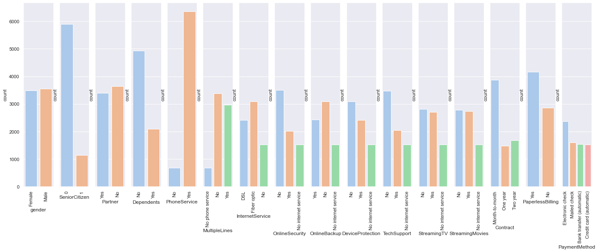
    


```python
for col in columns:
    print(df[col].value_counts())
    print('Percentage:', round(100 * df[col].value_counts()[0] / np.sum(df[col].value_counts()),2))
```

    Male      3549
    Female    3483
    Name: gender, dtype: int64
    Percentage: 50.47
    0    5890
    1    1142
    Name: SeniorCitizen, dtype: int64
    Percentage: 83.76
    No     3639
    Yes    3393
    Name: Partner, dtype: int64
    Percentage: 51.75
    No     4933
    Yes    2099
    Name: Dependents, dtype: int64
    Percentage: 70.15
    Yes    6352
    No      680
    Name: PhoneService, dtype: int64
    Percentage: 90.33
    No                  3385
    Yes                 2967
    No phone service     680
    Name: MultipleLines, dtype: int64
    Percentage: 48.14
    Fiber optic    3096
    DSL            2416
    No             1520
    Name: InternetService, dtype: int64
    Percentage: 44.03
    No                     3497
    Yes                    2015
    No internet service    1520
    Name: OnlineSecurity, dtype: int64
    Percentage: 49.73
    No                     3087
    Yes                    2425
    No internet service    1520
    Name: OnlineBackup, dtype: int64
    Percentage: 43.9
    No                     3094
    Yes                    2418
    No internet service    1520
    Name: DeviceProtection, dtype: int64
    Percentage: 44.0
    No                     3472
    Yes                    2040
    No internet service    1520
    Name: TechSupport, dtype: int64
    Percentage: 49.37
    No                     2809
    Yes                    2703
    No internet service    1520
    Name: StreamingTV, dtype: int64
    Percentage: 39.95
    No                     2781
    Yes                    2731
    No internet service    1520
    Name: StreamingMovies, dtype: int64
    Percentage: 39.55
    Month-to-month    3875
    Two year          1685
    One year          1472
    Name: Contract, dtype: int64
    Percentage: 55.11
    Yes    4168
    No     2864
    Name: PaperlessBilling, dtype: int64
    Percentage: 59.27
    Electronic check             2365
    Mailed check                 1604
    Bank transfer (automatic)    1542
    Credit card (automatic)      1521
    Name: PaymentMethod, dtype: int64
    Percentage: 33.63
    

From the chart and data above, we obtain a summary as such:
- There are almost equal number of Female customers as there are Male customers. (male = 3549, female = 3483)
- There is a 6:1 ratio of non-Senior citizens as opposed to Senior citizens. (non-senior = 5890, senior = 1142, 83.76%)
- There are almost equal number of customers who have a partner as there are customers who don't. (partner = 3639, no partner = 3393)
- There is a 5:2 ratio of customers who are still dependent compared to those who are independent. (dependent = 4933, independent = 2099)
- Almost all of the customers are using phone service -- a little bit bigger than a 6:1 ratio. (phone service = 6352, no phone service = 680)
- For customers with a phone service, there is a little bit more customers who don't use multiple lines compared to those that do. (multiple lines = 3385, no multiple lines = 2967)
- The fiber optic is the most popular internet service (3096), with DSL coming in second (2416), and no internet service coming in last (1520). 
- For customers with internet service, there are more customers without online security than there are with. (3497 vs 2015)
- For customers with internet service, there are more customers without online backup than there are with. (3087 vs 2425)
- For customers with internet service, there are more customers without device protection than there are with. (3094 vs 2418)
- For customers with internet service, there are more customers without tech support than there are with. (3472 vs 2040)
- For customers with internet service, there are almost equal number of customers with TV streaming as there are without. (2703 vs 2809) 
- For customers with internet service, there are almost equal number of customers with movie streaming as there are without. (2731 vs 2781)
- Comparing their contract types, there are 3875 customers paying Month-to-Month, 1472 customers paying One-year, and 1685 customers paying Two-year.
- There is a 4:3 ratio of customers using paperless billing as opposed to using paper billing. (4168 vs 2864)
- For payment method, most of the customers are using electronic check (2365), mailed check coming in second (1604), automatic bank transfer coming in third (1542), and automatic credit card coming in last (1521).

How do the monthly charges and total charges look with each categorical values?


```python
fig, ax = plt.subplots(1,16, figsize=(24,8), sharey=True)

for i in range(len(columns)):
    sns.barplot(data=df, x=columns[i], y='MonthlyCharges', ax=ax[i])

for ax in fig.axes:
    plt.sca(ax)
    plt.xticks(rotation=90)

plt.show()
```


    
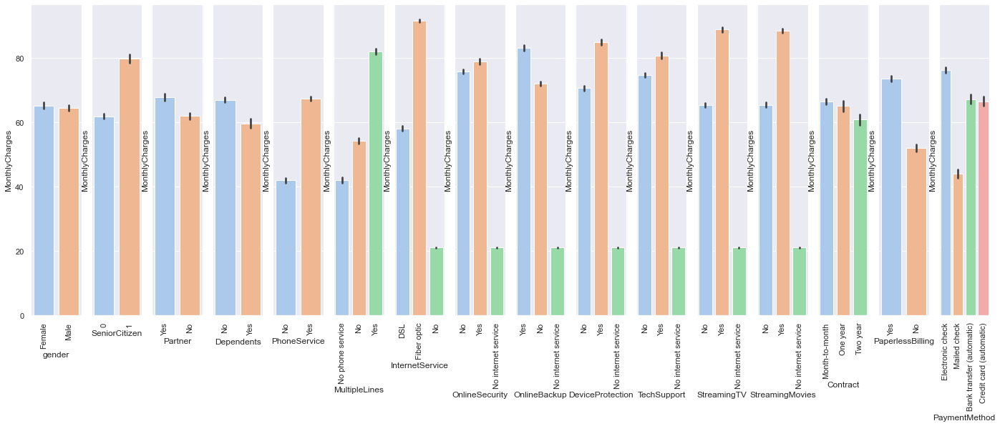
    


Key takeaways from the monthly charges chart above:
- Male and female customers are paying the same average monthly charge.
- Senior citizens have an average monthly charge of 80, while non senior citizens are paying around 60.
- Essentially, customers who have more support and services involved in their subscription have a higher monthly charge than those who don't.
- Fiber optic is more expensive than DSL, which is why the average monthly charge for those with Fiber optic is higher.
- The monthly charge of month-to-month is higher than one-year, and two-year is the lowest. This is expected as subscriptions with a longer contract should have a lower payment fee when calculated monthly.
- Customers without paperless billing are generally paying less monthly charge, while customers with paperless billing are paying more expensive monthly charge.
- Those that are paying with mailed check are paying lower monthly charges, while those paying with electronic check are generally paying higher monthly charges.


```python
fig, ax = plt.subplots(1,16, figsize=(24,8), sharey=True)

for i in range(len(columns)):
    sns.barplot(data=df, x=columns[i], y='TotalCharges', ax=ax[i])

for ax in fig.axes:
    plt.sca(ax)
    plt.xticks(rotation=90)

plt.show()
```


    
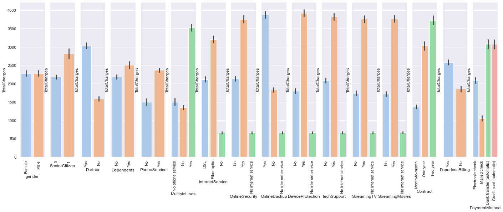
    


Since the total charge is essentially the monthly charge times tenure, then conceptually, it should look similar to the monthly charge, with more gap in the observations. However, looking at the contract and the payment method columns, it seems that there the longer the contract, the higher the total charge, and that automatic bank transfer and credit card method is higher in the total charge value. It could be that they have paid in advance with automatic payments, and as such, the values are higher when totaled.

What does the distribution of the monthly charges look like?


```python
sns.histplot(data=df, x='MonthlyCharges')
```


    <AxesSubplot:xlabel='MonthlyCharges', ylabel='Count'>


    
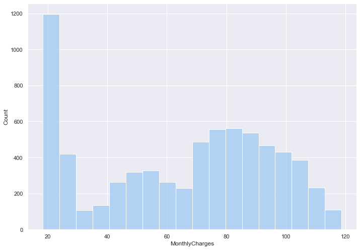
    


It seems that most of the customers are paying for the cheapest service. Then there are customers in the 45-60 monthly charge range and the around the 75-90 range. We'll take a look at those customers and what their subscription looks like later on.

Meanwhile, let's take a look at the distribution of the total charges, as below.


```python
sns.histplot(data=df, x='TotalCharges')
```


    <AxesSubplot:xlabel='TotalCharges', ylabel='Count'>


    
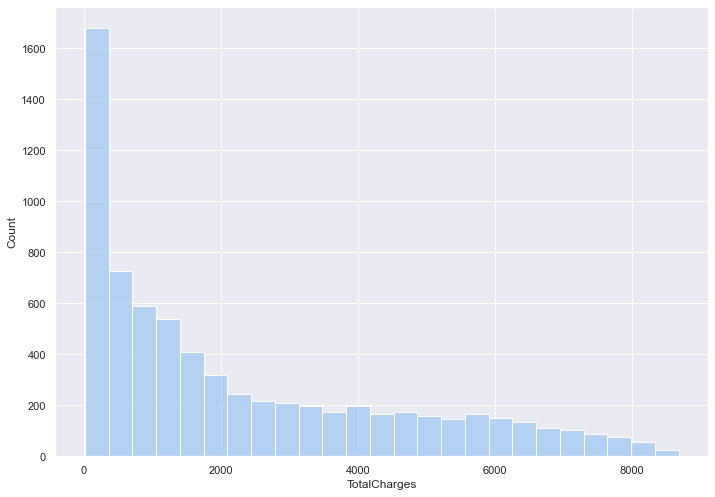
    


This is expected, since there should more new customers than there are older customers. Newer customers mean that they'd be paying less when totaled.

We spoke of the customers distributed by their monthly charge. To start off, let's look at what the cheapest subscriptions (lowest monthly charge) look like:


```python
df[df['MonthlyCharges'] < 30].sort_values('MonthlyCharges').tail(10)
```


<div>
<style scoped>
    .dataframe tbody tr th:only-of-type {
        vertical-align: middle;
    }

    .dataframe tbody tr th {
        vertical-align: top;
    }

    .dataframe thead th {
        text-align: right;
    }
</style>
<table border="1" class="dataframe">
  <thead>
    <tr style="text-align: right;">
      <th></th>
      <th>customerID</th>
      <th>gender</th>
      <th>SeniorCitizen</th>
      <th>Partner</th>
      <th>Dependents</th>
      <th>tenure</th>
      <th>PhoneService</th>
      <th>MultipleLines</th>
      <th>InternetService</th>
      <th>OnlineSecurity</th>
      <th>...</th>
      <th>DeviceProtection</th>
      <th>TechSupport</th>
      <th>StreamingTV</th>
      <th>StreamingMovies</th>
      <th>Contract</th>
      <th>PaperlessBilling</th>
      <th>PaymentMethod</th>
      <th>MonthlyCharges</th>
      <th>TotalCharges</th>
      <th>Churn</th>
    </tr>
  </thead>
  <tbody>
    <tr>
      <th>6494</th>
      <td>4310-KEDTB</td>
      <td>Female</td>
      <td>0</td>
      <td>No</td>
      <td>Yes</td>
      <td>26</td>
      <td>No</td>
      <td>No phone service</td>
      <td>DSL</td>
      <td>No</td>
      <td>...</td>
      <td>Yes</td>
      <td>No</td>
      <td>No</td>
      <td>No</td>
      <td>Month-to-month</td>
      <td>Yes</td>
      <td>Mailed check</td>
      <td>29.80</td>
      <td>786.50</td>
      <td>No</td>
    </tr>
    <tr>
      <th>4989</th>
      <td>0909-SDHNU</td>
      <td>Female</td>
      <td>0</td>
      <td>No</td>
      <td>Yes</td>
      <td>7</td>
      <td>No</td>
      <td>No phone service</td>
      <td>DSL</td>
      <td>Yes</td>
      <td>...</td>
      <td>No</td>
      <td>No</td>
      <td>No</td>
      <td>No</td>
      <td>Month-to-month</td>
      <td>No</td>
      <td>Mailed check</td>
      <td>29.80</td>
      <td>201.95</td>
      <td>No</td>
    </tr>
    <tr>
      <th>3139</th>
      <td>1142-WACZW</td>
      <td>Male</td>
      <td>0</td>
      <td>No</td>
      <td>No</td>
      <td>2</td>
      <td>No</td>
      <td>No phone service</td>
      <td>DSL</td>
      <td>No</td>
      <td>...</td>
      <td>No</td>
      <td>Yes</td>
      <td>No</td>
      <td>No</td>
      <td>Month-to-month</td>
      <td>No</td>
      <td>Bank transfer (automatic)</td>
      <td>29.85</td>
      <td>75.60</td>
      <td>Yes</td>
    </tr>
    <tr>
      <th>0</th>
      <td>7590-VHVEG</td>
      <td>Female</td>
      <td>0</td>
      <td>Yes</td>
      <td>No</td>
      <td>1</td>
      <td>No</td>
      <td>No phone service</td>
      <td>DSL</td>
      <td>No</td>
      <td>...</td>
      <td>No</td>
      <td>No</td>
      <td>No</td>
      <td>No</td>
      <td>Month-to-month</td>
      <td>Yes</td>
      <td>Electronic check</td>
      <td>29.85</td>
      <td>29.85</td>
      <td>No</td>
    </tr>
    <tr>
      <th>6777</th>
      <td>9572-WUKSB</td>
      <td>Male</td>
      <td>0</td>
      <td>Yes</td>
      <td>No</td>
      <td>3</td>
      <td>No</td>
      <td>No phone service</td>
      <td>DSL</td>
      <td>No</td>
      <td>...</td>
      <td>No</td>
      <td>Yes</td>
      <td>No</td>
      <td>No</td>
      <td>Month-to-month</td>
      <td>Yes</td>
      <td>Electronic check</td>
      <td>29.90</td>
      <td>92.25</td>
      <td>No</td>
    </tr>
    <tr>
      <th>3233</th>
      <td>0928-JMXNP</td>
      <td>Male</td>
      <td>1</td>
      <td>Yes</td>
      <td>No</td>
      <td>4</td>
      <td>No</td>
      <td>No phone service</td>
      <td>DSL</td>
      <td>No</td>
      <td>...</td>
      <td>Yes</td>
      <td>No</td>
      <td>No</td>
      <td>No</td>
      <td>Month-to-month</td>
      <td>Yes</td>
      <td>Electronic check</td>
      <td>29.90</td>
      <td>118.25</td>
      <td>No</td>
    </tr>
    <tr>
      <th>5034</th>
      <td>9758-MFWGD</td>
      <td>Female</td>
      <td>1</td>
      <td>Yes</td>
      <td>Yes</td>
      <td>48</td>
      <td>No</td>
      <td>No phone service</td>
      <td>DSL</td>
      <td>No</td>
      <td>...</td>
      <td>No</td>
      <td>No</td>
      <td>No</td>
      <td>No</td>
      <td>One year</td>
      <td>No</td>
      <td>Bank transfer (automatic)</td>
      <td>29.90</td>
      <td>1388.75</td>
      <td>No</td>
    </tr>
    <tr>
      <th>3902</th>
      <td>5999-LCXAO</td>
      <td>Female</td>
      <td>0</td>
      <td>No</td>
      <td>No</td>
      <td>1</td>
      <td>No</td>
      <td>No phone service</td>
      <td>DSL</td>
      <td>Yes</td>
      <td>...</td>
      <td>No</td>
      <td>No</td>
      <td>No</td>
      <td>No</td>
      <td>Month-to-month</td>
      <td>No</td>
      <td>Mailed check</td>
      <td>29.90</td>
      <td>29.90</td>
      <td>No</td>
    </tr>
    <tr>
      <th>180</th>
      <td>6317-YPKDH</td>
      <td>Female</td>
      <td>0</td>
      <td>No</td>
      <td>No</td>
      <td>1</td>
      <td>No</td>
      <td>No phone service</td>
      <td>DSL</td>
      <td>No</td>
      <td>...</td>
      <td>No</td>
      <td>No</td>
      <td>No</td>
      <td>No</td>
      <td>Month-to-month</td>
      <td>No</td>
      <td>Bank transfer (automatic)</td>
      <td>29.95</td>
      <td>29.95</td>
      <td>Yes</td>
    </tr>
    <tr>
      <th>610</th>
      <td>6543-CPZMK</td>
      <td>Male</td>
      <td>0</td>
      <td>Yes</td>
      <td>Yes</td>
      <td>9</td>
      <td>No</td>
      <td>No phone service</td>
      <td>DSL</td>
      <td>No</td>
      <td>...</td>
      <td>No</td>
      <td>No</td>
      <td>No</td>
      <td>No</td>
      <td>Month-to-month</td>
      <td>Yes</td>
      <td>Electronic check</td>
      <td>29.95</td>
      <td>248.95</td>
      <td>Yes</td>
    </tr>
  </tbody>
</table>
<p>10 rows × 21 columns</p>
</div>


We can see that they simply have the DSL internet service, no phone service, and barely any of the other services supported. They are also generally paying month-to-month.


```python
df[(df['MonthlyCharges'] > 45) & (df['MonthlyCharges'] < 60)].sort_values('MonthlyCharges').tail(10)
```


<div>
<style scoped>
    .dataframe tbody tr th:only-of-type {
        vertical-align: middle;
    }

    .dataframe tbody tr th {
        vertical-align: top;
    }

    .dataframe thead th {
        text-align: right;
    }
</style>
<table border="1" class="dataframe">
  <thead>
    <tr style="text-align: right;">
      <th></th>
      <th>customerID</th>
      <th>gender</th>
      <th>SeniorCitizen</th>
      <th>Partner</th>
      <th>Dependents</th>
      <th>tenure</th>
      <th>PhoneService</th>
      <th>MultipleLines</th>
      <th>InternetService</th>
      <th>OnlineSecurity</th>
      <th>...</th>
      <th>DeviceProtection</th>
      <th>TechSupport</th>
      <th>StreamingTV</th>
      <th>StreamingMovies</th>
      <th>Contract</th>
      <th>PaperlessBilling</th>
      <th>PaymentMethod</th>
      <th>MonthlyCharges</th>
      <th>TotalCharges</th>
      <th>Churn</th>
    </tr>
  </thead>
  <tbody>
    <tr>
      <th>5935</th>
      <td>2931-FSOHN</td>
      <td>Male</td>
      <td>1</td>
      <td>No</td>
      <td>No</td>
      <td>13</td>
      <td>Yes</td>
      <td>No</td>
      <td>DSL</td>
      <td>No</td>
      <td>...</td>
      <td>No</td>
      <td>No</td>
      <td>Yes</td>
      <td>No</td>
      <td>Month-to-month</td>
      <td>Yes</td>
      <td>Electronic check</td>
      <td>59.90</td>
      <td>788.35</td>
      <td>No</td>
    </tr>
    <tr>
      <th>5507</th>
      <td>5753-QQWPW</td>
      <td>Female</td>
      <td>0</td>
      <td>No</td>
      <td>No</td>
      <td>28</td>
      <td>Yes</td>
      <td>No</td>
      <td>DSL</td>
      <td>Yes</td>
      <td>...</td>
      <td>No</td>
      <td>Yes</td>
      <td>No</td>
      <td>No</td>
      <td>One year</td>
      <td>Yes</td>
      <td>Electronic check</td>
      <td>59.90</td>
      <td>1654.70</td>
      <td>No</td>
    </tr>
    <tr>
      <th>3082</th>
      <td>3401-URHDA</td>
      <td>Male</td>
      <td>0</td>
      <td>No</td>
      <td>No</td>
      <td>51</td>
      <td>Yes</td>
      <td>Yes</td>
      <td>DSL</td>
      <td>Yes</td>
      <td>...</td>
      <td>No</td>
      <td>Yes</td>
      <td>No</td>
      <td>No</td>
      <td>One year</td>
      <td>No</td>
      <td>Credit card (automatic)</td>
      <td>59.90</td>
      <td>3043.60</td>
      <td>No</td>
    </tr>
    <tr>
      <th>2641</th>
      <td>8250-ZNGGW</td>
      <td>Female</td>
      <td>1</td>
      <td>No</td>
      <td>No</td>
      <td>5</td>
      <td>Yes</td>
      <td>No</td>
      <td>DSL</td>
      <td>Yes</td>
      <td>...</td>
      <td>No</td>
      <td>Yes</td>
      <td>No</td>
      <td>No</td>
      <td>Month-to-month</td>
      <td>No</td>
      <td>Credit card (automatic)</td>
      <td>59.90</td>
      <td>287.85</td>
      <td>No</td>
    </tr>
    <tr>
      <th>5884</th>
      <td>4785-QRJHC</td>
      <td>Male</td>
      <td>1</td>
      <td>Yes</td>
      <td>No</td>
      <td>46</td>
      <td>No</td>
      <td>No phone service</td>
      <td>DSL</td>
      <td>No</td>
      <td>...</td>
      <td>Yes</td>
      <td>Yes</td>
      <td>Yes</td>
      <td>Yes</td>
      <td>One year</td>
      <td>Yes</td>
      <td>Bank transfer (automatic)</td>
      <td>59.90</td>
      <td>2816.65</td>
      <td>Yes</td>
    </tr>
    <tr>
      <th>23</th>
      <td>3638-WEABW</td>
      <td>Female</td>
      <td>0</td>
      <td>Yes</td>
      <td>No</td>
      <td>58</td>
      <td>Yes</td>
      <td>Yes</td>
      <td>DSL</td>
      <td>No</td>
      <td>...</td>
      <td>No</td>
      <td>Yes</td>
      <td>No</td>
      <td>No</td>
      <td>Two year</td>
      <td>Yes</td>
      <td>Credit card (automatic)</td>
      <td>59.90</td>
      <td>3505.10</td>
      <td>No</td>
    </tr>
    <tr>
      <th>3488</th>
      <td>0003-MKNFE</td>
      <td>Male</td>
      <td>0</td>
      <td>No</td>
      <td>No</td>
      <td>9</td>
      <td>Yes</td>
      <td>Yes</td>
      <td>DSL</td>
      <td>No</td>
      <td>...</td>
      <td>No</td>
      <td>No</td>
      <td>No</td>
      <td>Yes</td>
      <td>Month-to-month</td>
      <td>No</td>
      <td>Mailed check</td>
      <td>59.90</td>
      <td>542.40</td>
      <td>No</td>
    </tr>
    <tr>
      <th>366</th>
      <td>9069-LGEUL</td>
      <td>Male</td>
      <td>0</td>
      <td>Yes</td>
      <td>No</td>
      <td>23</td>
      <td>Yes</td>
      <td>No</td>
      <td>DSL</td>
      <td>Yes</td>
      <td>...</td>
      <td>No</td>
      <td>No</td>
      <td>No</td>
      <td>Yes</td>
      <td>Month-to-month</td>
      <td>Yes</td>
      <td>Bank transfer (automatic)</td>
      <td>59.95</td>
      <td>1406.00</td>
      <td>No</td>
    </tr>
    <tr>
      <th>4200</th>
      <td>8316-BBQAY</td>
      <td>Female</td>
      <td>0</td>
      <td>No</td>
      <td>No</td>
      <td>65</td>
      <td>No</td>
      <td>No phone service</td>
      <td>DSL</td>
      <td>Yes</td>
      <td>...</td>
      <td>Yes</td>
      <td>Yes</td>
      <td>Yes</td>
      <td>Yes</td>
      <td>Two year</td>
      <td>No</td>
      <td>Credit card (automatic)</td>
      <td>59.95</td>
      <td>3921.10</td>
      <td>No</td>
    </tr>
    <tr>
      <th>5829</th>
      <td>6933-VLYFX</td>
      <td>Male</td>
      <td>0</td>
      <td>Yes</td>
      <td>Yes</td>
      <td>31</td>
      <td>No</td>
      <td>No phone service</td>
      <td>DSL</td>
      <td>Yes</td>
      <td>...</td>
      <td>Yes</td>
      <td>Yes</td>
      <td>Yes</td>
      <td>Yes</td>
      <td>One year</td>
      <td>No</td>
      <td>Electronic check</td>
      <td>59.95</td>
      <td>1848.80</td>
      <td>No</td>
    </tr>
  </tbody>
</table>
<p>10 rows × 21 columns</p>
</div>


In the middle distribution, we still see DSLs, however, the customers here will have upgraded some of the services, but not all at the same time. There are no other patterns seen.


```python
df[(df['MonthlyCharges'] > 70) & (df['MonthlyCharges'] < 90)].sort_values('MonthlyCharges').tail(10)
```


<div>
<style scoped>
    .dataframe tbody tr th:only-of-type {
        vertical-align: middle;
    }

    .dataframe tbody tr th {
        vertical-align: top;
    }

    .dataframe thead th {
        text-align: right;
    }
</style>
<table border="1" class="dataframe">
  <thead>
    <tr style="text-align: right;">
      <th></th>
      <th>customerID</th>
      <th>gender</th>
      <th>SeniorCitizen</th>
      <th>Partner</th>
      <th>Dependents</th>
      <th>tenure</th>
      <th>PhoneService</th>
      <th>MultipleLines</th>
      <th>InternetService</th>
      <th>OnlineSecurity</th>
      <th>...</th>
      <th>DeviceProtection</th>
      <th>TechSupport</th>
      <th>StreamingTV</th>
      <th>StreamingMovies</th>
      <th>Contract</th>
      <th>PaperlessBilling</th>
      <th>PaymentMethod</th>
      <th>MonthlyCharges</th>
      <th>TotalCharges</th>
      <th>Churn</th>
    </tr>
  </thead>
  <tbody>
    <tr>
      <th>61</th>
      <td>1215-FIGMP</td>
      <td>Male</td>
      <td>0</td>
      <td>No</td>
      <td>No</td>
      <td>60</td>
      <td>Yes</td>
      <td>Yes</td>
      <td>Fiber optic</td>
      <td>No</td>
      <td>...</td>
      <td>No</td>
      <td>No</td>
      <td>Yes</td>
      <td>No</td>
      <td>Month-to-month</td>
      <td>Yes</td>
      <td>Bank transfer (automatic)</td>
      <td>89.90</td>
      <td>5450.70</td>
      <td>No</td>
    </tr>
    <tr>
      <th>2983</th>
      <td>4674-HGNUA</td>
      <td>Male</td>
      <td>0</td>
      <td>Yes</td>
      <td>Yes</td>
      <td>71</td>
      <td>Yes</td>
      <td>Yes</td>
      <td>DSL</td>
      <td>Yes</td>
      <td>...</td>
      <td>Yes</td>
      <td>Yes</td>
      <td>Yes</td>
      <td>Yes</td>
      <td>Two year</td>
      <td>No</td>
      <td>Credit card (automatic)</td>
      <td>89.90</td>
      <td>6457.15</td>
      <td>No</td>
    </tr>
    <tr>
      <th>3654</th>
      <td>8751-EDEKA</td>
      <td>Female</td>
      <td>0</td>
      <td>Yes</td>
      <td>No</td>
      <td>28</td>
      <td>Yes</td>
      <td>No</td>
      <td>Fiber optic</td>
      <td>No</td>
      <td>...</td>
      <td>Yes</td>
      <td>No</td>
      <td>No</td>
      <td>Yes</td>
      <td>Month-to-month</td>
      <td>No</td>
      <td>Credit card (automatic)</td>
      <td>89.90</td>
      <td>2433.50</td>
      <td>No</td>
    </tr>
    <tr>
      <th>844</th>
      <td>3027-ZTDHO</td>
      <td>Male</td>
      <td>0</td>
      <td>No</td>
      <td>No</td>
      <td>1</td>
      <td>Yes</td>
      <td>No</td>
      <td>Fiber optic</td>
      <td>No</td>
      <td>...</td>
      <td>No</td>
      <td>No</td>
      <td>Yes</td>
      <td>Yes</td>
      <td>Month-to-month</td>
      <td>Yes</td>
      <td>Electronic check</td>
      <td>89.90</td>
      <td>89.90</td>
      <td>Yes</td>
    </tr>
    <tr>
      <th>4379</th>
      <td>7691-XVTZH</td>
      <td>Female</td>
      <td>0</td>
      <td>Yes</td>
      <td>No</td>
      <td>68</td>
      <td>Yes</td>
      <td>Yes</td>
      <td>Fiber optic</td>
      <td>No</td>
      <td>...</td>
      <td>Yes</td>
      <td>No</td>
      <td>Yes</td>
      <td>No</td>
      <td>Two year</td>
      <td>Yes</td>
      <td>Bank transfer (automatic)</td>
      <td>89.95</td>
      <td>5974.30</td>
      <td>No</td>
    </tr>
    <tr>
      <th>2997</th>
      <td>1891-FZYSA</td>
      <td>Male</td>
      <td>1</td>
      <td>Yes</td>
      <td>No</td>
      <td>69</td>
      <td>Yes</td>
      <td>Yes</td>
      <td>Fiber optic</td>
      <td>No</td>
      <td>...</td>
      <td>No</td>
      <td>No</td>
      <td>Yes</td>
      <td>No</td>
      <td>Month-to-month</td>
      <td>Yes</td>
      <td>Electronic check</td>
      <td>89.95</td>
      <td>6143.15</td>
      <td>Yes</td>
    </tr>
    <tr>
      <th>1751</th>
      <td>9436-ZBZCT</td>
      <td>Male</td>
      <td>0</td>
      <td>No</td>
      <td>No</td>
      <td>14</td>
      <td>Yes</td>
      <td>Yes</td>
      <td>Fiber optic</td>
      <td>No</td>
      <td>...</td>
      <td>No</td>
      <td>Yes</td>
      <td>Yes</td>
      <td>No</td>
      <td>Month-to-month</td>
      <td>Yes</td>
      <td>Electronic check</td>
      <td>89.95</td>
      <td>1178.40</td>
      <td>Yes</td>
    </tr>
    <tr>
      <th>3907</th>
      <td>2139-FQHLM</td>
      <td>Male</td>
      <td>0</td>
      <td>No</td>
      <td>No</td>
      <td>19</td>
      <td>Yes</td>
      <td>No</td>
      <td>Fiber optic</td>
      <td>No</td>
      <td>...</td>
      <td>Yes</td>
      <td>Yes</td>
      <td>Yes</td>
      <td>No</td>
      <td>Month-to-month</td>
      <td>No</td>
      <td>Mailed check</td>
      <td>89.95</td>
      <td>1682.40</td>
      <td>No</td>
    </tr>
    <tr>
      <th>2219</th>
      <td>1302-UHBDD</td>
      <td>Male</td>
      <td>1</td>
      <td>No</td>
      <td>No</td>
      <td>20</td>
      <td>Yes</td>
      <td>No</td>
      <td>Fiber optic</td>
      <td>No</td>
      <td>...</td>
      <td>No</td>
      <td>No</td>
      <td>Yes</td>
      <td>Yes</td>
      <td>Month-to-month</td>
      <td>No</td>
      <td>Electronic check</td>
      <td>89.95</td>
      <td>1648.45</td>
      <td>No</td>
    </tr>
    <tr>
      <th>2223</th>
      <td>8182-BJDSI</td>
      <td>Female</td>
      <td>0</td>
      <td>No</td>
      <td>No</td>
      <td>28</td>
      <td>Yes</td>
      <td>Yes</td>
      <td>Fiber optic</td>
      <td>No</td>
      <td>...</td>
      <td>No</td>
      <td>No</td>
      <td>No</td>
      <td>Yes</td>
      <td>Month-to-month</td>
      <td>Yes</td>
      <td>Electronic check</td>
      <td>89.95</td>
      <td>2625.55</td>
      <td>Yes</td>
    </tr>
  </tbody>
</table>
<p>10 rows × 21 columns</p>
</div>


In the last distribution with the higher monthly charge, we see that most of these customers have the fiber optic internet service, which causes the rise in the monthly charge. We do also see that there are customers with DSL plus all of the services supported in their subscription, which amounts to the same monthly charge as the fiber optic internet service.

With the different types of internet service, what type of contracts are these customers on?


```python
sns.countplot(data=df, x='InternetService', hue='Contract')
```


    <AxesSubplot:xlabel='InternetService', ylabel='count'>


    
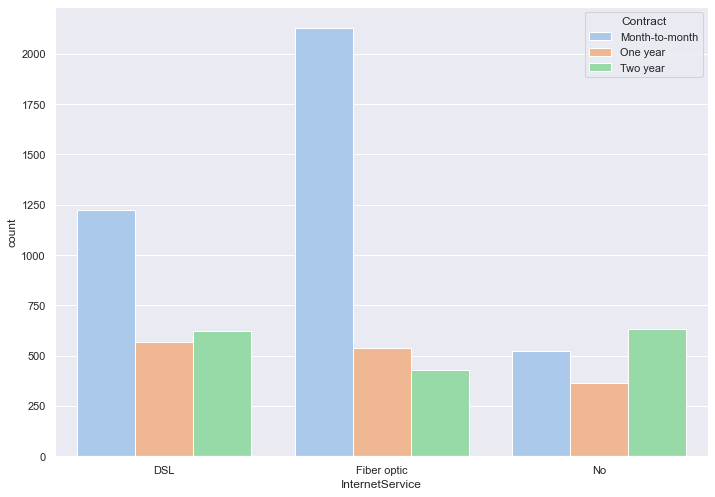
    


The subscriptions are generally month-to-month for any of the internet service type, and we do see that fiber optic is the most popular internet service.

Is there any correlation between gender and contract type? What about with senior citizenship with contract type?


```python
sns.countplot(data=df, x='Contract', hue='gender')
```


    <AxesSubplot:xlabel='Contract', ylabel='count'>


    
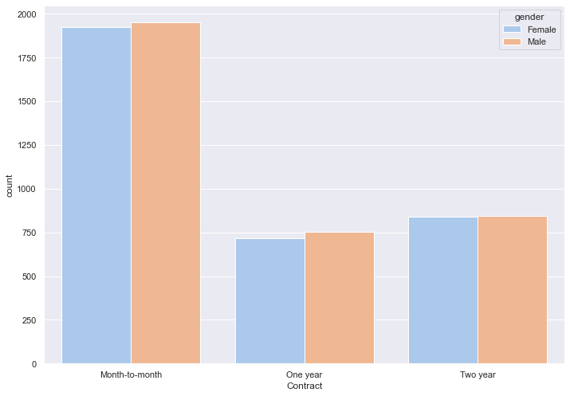
    


```python
sns.countplot(data=df, x='Contract', hue='SeniorCitizen')
```


    <AxesSubplot:xlabel='Contract', ylabel='count'>


    

    


There is no difference in the contract type based on gender, however, we do see a pattern with senior citizenship. Senior citizens tend to go for the month-to-month contract type as opposed to the one year and two year contracts. Meanwhile, with non-senior citizens, month-to-month may also be the most popular contract type, but we do also see a lot of them subscribing for two year and one year contracts.

What is the correlation between tenure and monthly charges? How about tenure with total charges?


```python
sns.lineplot(data=df, x='tenure', y='MonthlyCharges')
```


    <AxesSubplot:xlabel='tenure', ylabel='MonthlyCharges'>


    
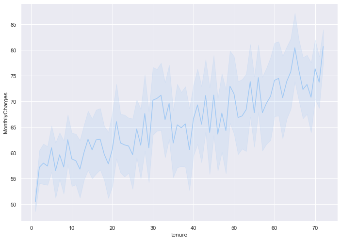
    


```python
sns.lineplot(data=df, x='tenure', y='TotalCharges')
```


    <AxesSubplot:xlabel='tenure', ylabel='TotalCharges'>


    
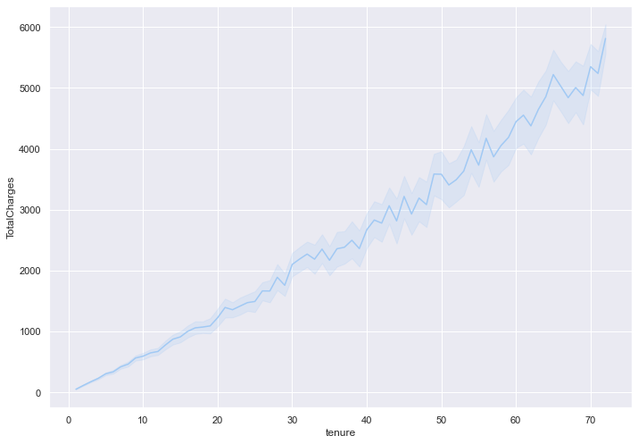
    


They both have an upward trend, with monthly charge being more scaly than the total charge due to the monthly charge having more variety. This means that generally, the longer the tenure, the higher the charge, monthly or total.

Now, let's see the ratio of customers who churned versus the ones who didn't.


```python
sns.countplot(data=df, x='Churn')
churned = df[df['Churn'] == 'Yes']
print('Percentage of churned customers:', round( 100 * len(churned) / len(df['Churn']), 2))
```

    Percentage of churned customers: 26.58
    


    
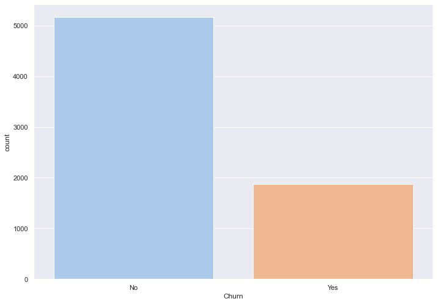
    


26.58% customers churned, which is close to 2000 customers out of the 7000+ customer entries that we have in this dataset.

Do the features in the dataset have any correlations with one another?


```python
from sklearn.preprocessing import OneHotEncoder
```


```python
onehotencoder = OneHotEncoder()

for col in df.columns:
    if (df[col].dtype == 'object') | (df[col].dtype == 'bool'):
        df[col] = onehotencoder.fit_transform(df[col].values.reshape(-1,1)).toarray()
df.head()
```


<div>
<style scoped>
    .dataframe tbody tr th:only-of-type {
        vertical-align: middle;
    }

    .dataframe tbody tr th {
        vertical-align: top;
    }

    .dataframe thead th {
        text-align: right;
    }
</style>
<table border="1" class="dataframe">
  <thead>
    <tr style="text-align: right;">
      <th></th>
      <th>customerID</th>
      <th>gender</th>
      <th>SeniorCitizen</th>
      <th>Partner</th>
      <th>Dependents</th>
      <th>tenure</th>
      <th>PhoneService</th>
      <th>MultipleLines</th>
      <th>InternetService</th>
      <th>OnlineSecurity</th>
      <th>...</th>
      <th>DeviceProtection</th>
      <th>TechSupport</th>
      <th>StreamingTV</th>
      <th>StreamingMovies</th>
      <th>Contract</th>
      <th>PaperlessBilling</th>
      <th>PaymentMethod</th>
      <th>MonthlyCharges</th>
      <th>TotalCharges</th>
      <th>Churn</th>
    </tr>
  </thead>
  <tbody>
    <tr>
      <th>0</th>
      <td>0.0</td>
      <td>1.0</td>
      <td>0</td>
      <td>0.0</td>
      <td>1.0</td>
      <td>1</td>
      <td>1.0</td>
      <td>0.0</td>
      <td>1.0</td>
      <td>1.0</td>
      <td>...</td>
      <td>1.0</td>
      <td>1.0</td>
      <td>1.0</td>
      <td>1.0</td>
      <td>1.0</td>
      <td>0.0</td>
      <td>0.0</td>
      <td>29.85</td>
      <td>29.85</td>
      <td>1.0</td>
    </tr>
    <tr>
      <th>1</th>
      <td>0.0</td>
      <td>0.0</td>
      <td>0</td>
      <td>1.0</td>
      <td>1.0</td>
      <td>34</td>
      <td>0.0</td>
      <td>1.0</td>
      <td>1.0</td>
      <td>0.0</td>
      <td>...</td>
      <td>0.0</td>
      <td>1.0</td>
      <td>1.0</td>
      <td>1.0</td>
      <td>0.0</td>
      <td>1.0</td>
      <td>0.0</td>
      <td>56.95</td>
      <td>1889.50</td>
      <td>1.0</td>
    </tr>
    <tr>
      <th>2</th>
      <td>0.0</td>
      <td>0.0</td>
      <td>0</td>
      <td>1.0</td>
      <td>1.0</td>
      <td>2</td>
      <td>0.0</td>
      <td>1.0</td>
      <td>1.0</td>
      <td>0.0</td>
      <td>...</td>
      <td>1.0</td>
      <td>1.0</td>
      <td>1.0</td>
      <td>1.0</td>
      <td>1.0</td>
      <td>0.0</td>
      <td>0.0</td>
      <td>53.85</td>
      <td>108.15</td>
      <td>0.0</td>
    </tr>
    <tr>
      <th>3</th>
      <td>0.0</td>
      <td>0.0</td>
      <td>0</td>
      <td>1.0</td>
      <td>1.0</td>
      <td>45</td>
      <td>1.0</td>
      <td>0.0</td>
      <td>1.0</td>
      <td>0.0</td>
      <td>...</td>
      <td>0.0</td>
      <td>0.0</td>
      <td>1.0</td>
      <td>1.0</td>
      <td>0.0</td>
      <td>1.0</td>
      <td>1.0</td>
      <td>42.30</td>
      <td>1840.75</td>
      <td>1.0</td>
    </tr>
    <tr>
      <th>4</th>
      <td>0.0</td>
      <td>1.0</td>
      <td>0</td>
      <td>1.0</td>
      <td>1.0</td>
      <td>2</td>
      <td>0.0</td>
      <td>1.0</td>
      <td>0.0</td>
      <td>1.0</td>
      <td>...</td>
      <td>1.0</td>
      <td>1.0</td>
      <td>1.0</td>
      <td>1.0</td>
      <td>1.0</td>
      <td>0.0</td>
      <td>0.0</td>
      <td>70.70</td>
      <td>151.65</td>
      <td>0.0</td>
    </tr>
  </tbody>
</table>
<p>5 rows × 21 columns</p>
</div>


```python
#print(df.corr())
sns.heatmap(df.corr())
```


    <AxesSubplot:>


    
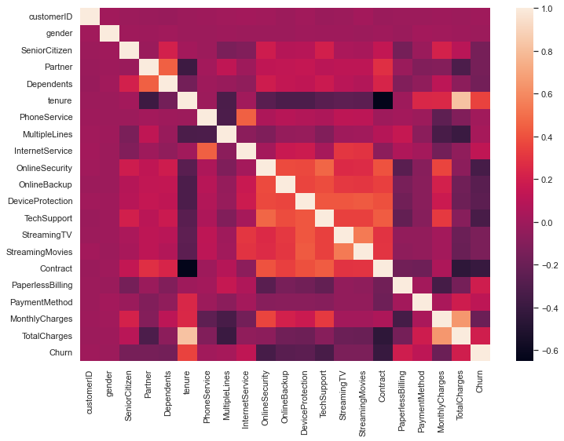
    


As proven before, tenure, monthly charges, and total charges are closely correlated to each other. Other than that, we can also see correlations among some other features. Each of the different types of services supported are sort of related to each other, and a few of them are related to the monthly charges. We can also see that the one feature that is seen to be most correlated to the churn variable is tenure.

## DATA PREPROCESSING


## Label Encoder


```python
# from sklearn.preprocessing import LabelEncoder
```


```python
# le = LabelEncoder()

# for col in df.columns:
#     if (df[col].dtype == 'object') | (df[col].dtype == 'bool'):
#         df[col] = le.fit_transform(df[col])
# df.head()
```

## Feature Selection


```python
from sklearn.linear_model import LogisticRegression
```


```python
X = df.drop('Churn', axis=1)
y = df['Churn']
print(X.shape, y.shape)
```

    (7032, 20) (7032,)
    


```python
model = LogisticRegression(solver='lbfgs', max_iter=1000)
model.fit(X, y)
importance = model.coef_[0]

feature_dict = {}
for i, v in enumerate(importance):
    feature_dict[i] = v

for k in feature_dict:
    print('Feature: %0d, Score: %.5f' % (k, feature_dict[k]))
```

    Feature: 0, Score: 0.01298
    Feature: 1, Score: 0.00745
    Feature: 2, Score: -0.16868
    Feature: 3, Score: 0.00270
    Feature: 4, Score: -0.12922
    Feature: 5, Score: 0.06044
    Feature: 6, Score: -0.63948
    Feature: 7, Score: 0.29077
    Feature: 8, Score: 0.55197
    Feature: 9, Score: -0.48796
    Feature: 10, Score: -0.24460
    Feature: 11, Score: -0.13621
    Feature: 12, Score: -0.45620
    Feature: 13, Score: 0.09786
    Feature: 14, Score: 0.11117
    Feature: 15, Score: -0.87812
    Feature: 16, Score: 0.38402
    Feature: 17, Score: 0.13701
    Feature: 18, Score: -0.01119
    Feature: 19, Score: -0.00030
    


```python
sns.barplot(x=[x for x in feature_dict.keys()], y=[x for x in feature_dict.values()])
plt.show()
```


    
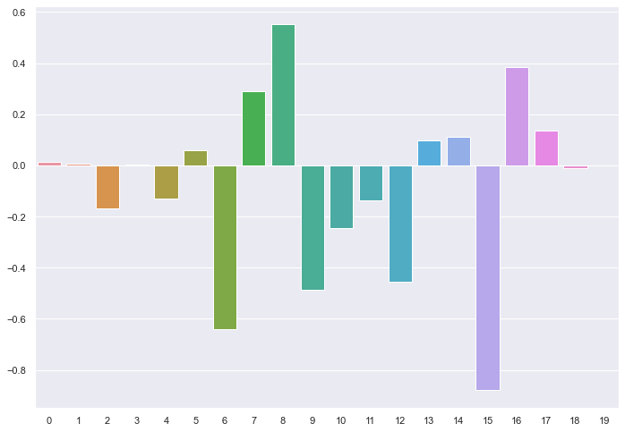
    


15 Contract          \
16 PaperlessBilling  \
6 PhoneService      \
9 OnlineSecurity    \
12 TechSupport\import xgboost
2 SeniorCitizen\
4 Dependents


```python
from xgboost import XGBRegressor
```


```python
model = XGBRegressor()
model.fit(X, y)
importance = model.feature_importances_

feature_dict = {}
for i, v in enumerate(importance):
    feature_dict[i] = v

for k in feature_dict:
    print('Feature: %0d, Score: %.5f' % (k, feature_dict[k]))
```

    Feature: 0, Score: 0.00000
    Feature: 1, Score: 0.01562
    Feature: 2, Score: 0.01842
    Feature: 3, Score: 0.01861
    Feature: 4, Score: 0.01828
    Feature: 5, Score: 0.03604
    Feature: 6, Score: 0.02713
    Feature: 7, Score: 0.03341
    Feature: 8, Score: 0.12100
    Feature: 9, Score: 0.08779
    Feature: 10, Score: 0.03326
    Feature: 11, Score: 0.02427
    Feature: 12, Score: 0.08134
    Feature: 13, Score: 0.02816
    Feature: 14, Score: 0.03449
    Feature: 15, Score: 0.30964
    Feature: 16, Score: 0.02827
    Feature: 17, Score: 0.01963
    Feature: 18, Score: 0.03306
    Feature: 19, Score: 0.03156
    


```python
sns.barplot(x=[x for x in feature_dict.keys()], y=[x for x in feature_dict.values()])
plt.show()
```


    
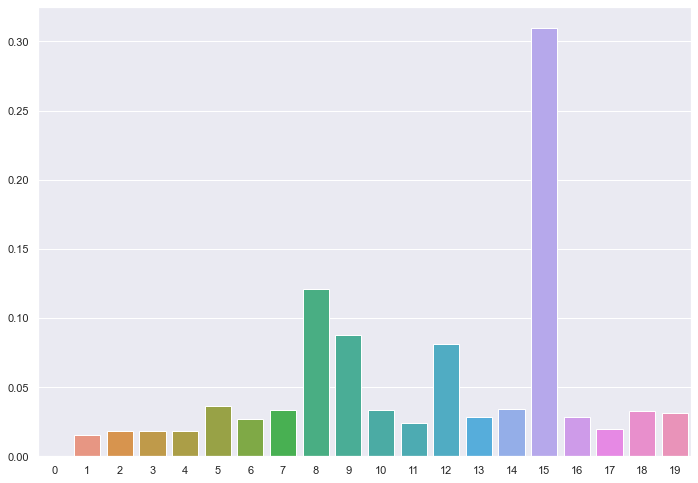
    


15 Contract\
8 Internet Service\
9 Online Security\
12 Tech Support

## Training and Testing


```python
X, y = df.iloc[:, [15,8,9,12]], df['Churn']
print(X.shape, y.shape)
```

    (7032, 4) (7032,)
    


```python
from sklearn.model_selection import train_test_split
from sklearn.neighbors import KNeighborsClassifier
from sklearn.model_selection import cross_val_score, GridSearchCV
from sklearn.metrics import classification_report, confusion_matrix
from sklearn.preprocessing import StandardScaler
from sklearn.pipeline import Pipeline
```


```python
steps =[('scaler', StandardScaler()), 
        ('knn', KNeighborsClassifier())]
parameters = {'knn__n_neighbors': np.arange(1,50)}
```


```python
# scaler = StandardScaler()
# knn = KNeighborsClassifier()
pipeline = Pipeline(steps)
X_train, X_test, y_train, y_test = train_test_split(X, y, test_size = 0.25, random_state = 42, stratify=y)
cv = GridSearchCV(pipeline, param_grid=parameters)
```


```python
cv.fit(X_train, y_train)
y_pred = cv.predict(X_test)
print('done')
```

    done
    


```python
print(cv.best_params_)
print(cv.best_score_)
#print(cv.cv_results_)
```

    {'knn__n_neighbors': 20}
    0.7614764786819789
    

True Positive | False Negative\
-----------------------------\
False Positive | True Negative


```python
print(confusion_matrix(y_test, y_pred))
print(classification_report(y_test, y_pred))
```

    [[ 251  216]
     [ 182 1109]]
                  precision    recall  f1-score   support
    
             0.0       0.58      0.54      0.56       467
             1.0       0.84      0.86      0.85      1291
    
        accuracy                           0.77      1758
       macro avg       0.71      0.70      0.70      1758
    weighted avg       0.77      0.77      0.77      1758
    
    


```python

```
